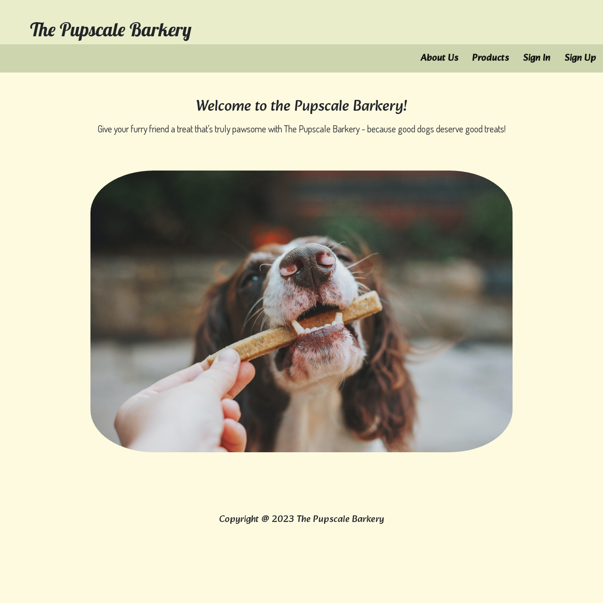
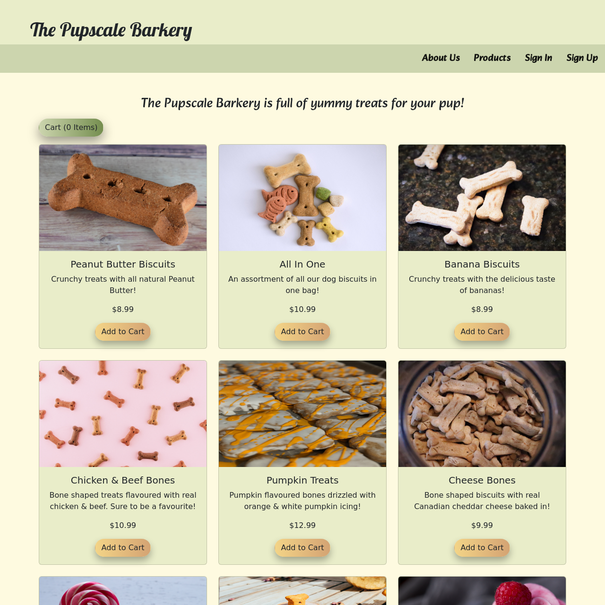
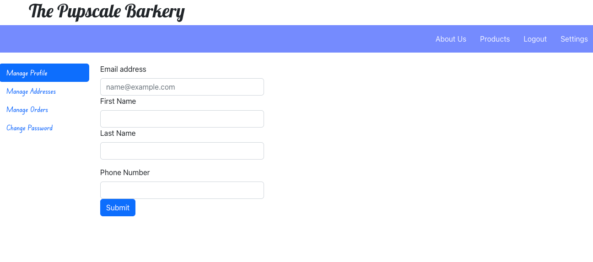
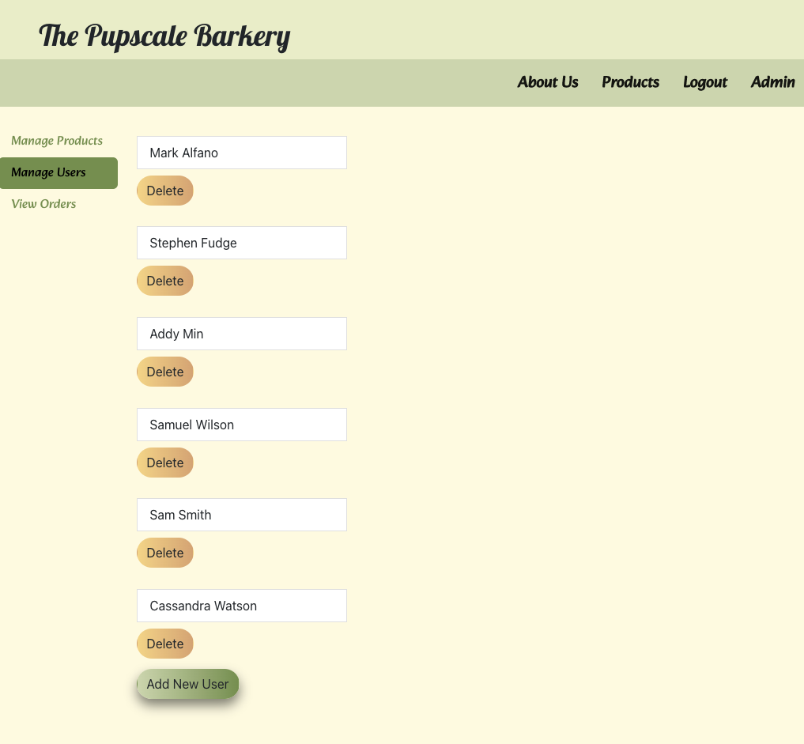
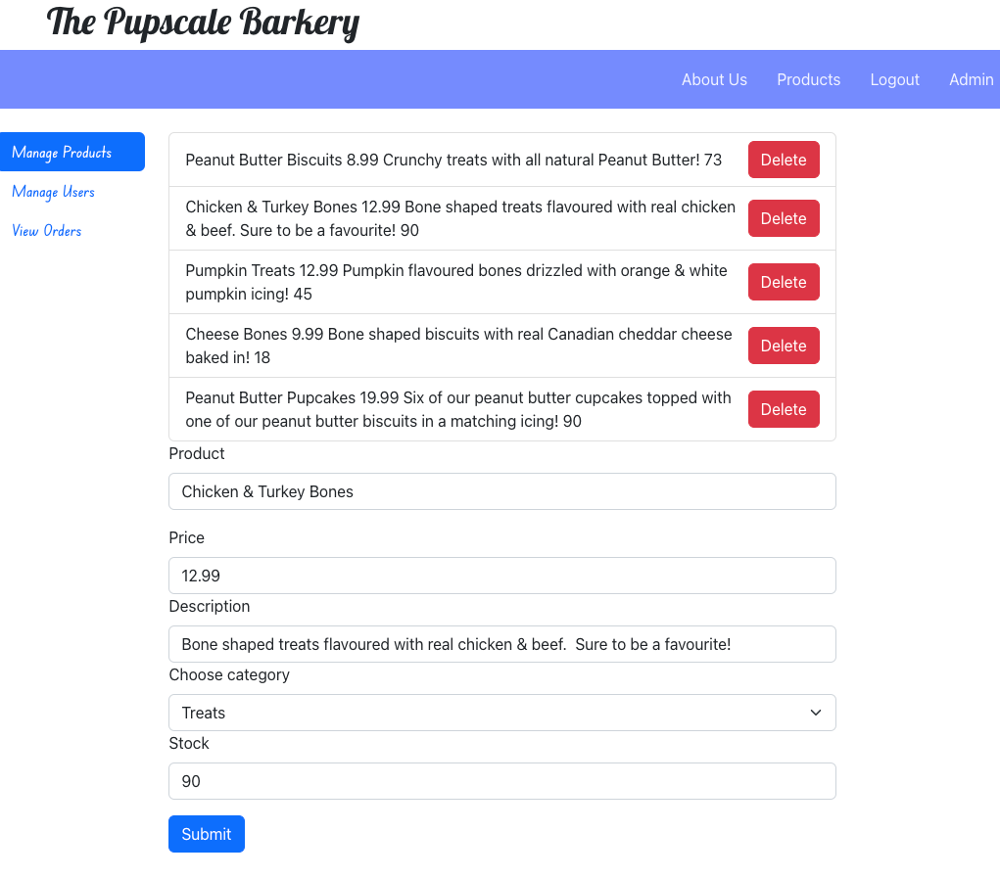

# The Pupscale Barkery 

## Description

This Pet Supply Ecommerce website allows small business owners to showcase their products. It also includes an admin panel so that business owners can edit their products, stock and manage the users on the site. Users are able to make an account to purchase products and be able to edit their acccount.

## User Story

AS THE owner of pet supply co,
I WANT to create an ecommerce site, for my small dog product business
SO THAT I do not need a third party company to showcase/sell my products.

## Table of Contents

- [Installation](#installation)
- [Usage](#usage)
- [How to Contribute](#contributions)
- [Tests](#tests)
- [Credits](#credits)
- [Questions](#questions)

## Installation

Navigate to the [Pet-Supply-Ecommerce-Store](https://theospetbakery.herokuapp.com/)

## Usage

Customers:
When users view the home page, they are brought to a home page with a welcome message and navigations tabs that include: About Us, Products, Sign In and Sign Up.

## 

When the user successfuly signs in or signs up, they are brought to the home page and now have access to view the product page.

In the product page, when the user selects a product, then the product is added to the cart. When the product is add to cart, then the total is updated. When an item is deleted from cart, then the total is updated.

## 

When the user views their profile, then they can update their email, first name, last name and phone number. Please note: managing addresses, orders and changing password coming soon!

## 

ADMIN:

When the admin logs in they are brought to the homepage and have access to the 'Admin' tab in the navigation bar. In the 'Admin' tab, they can manage users, and manage products. In manage users, they are able to view all users, edit the users, add a new user and grant a user admin access. Please Note: viewing orders is coming soon!

## 

In the manage products, the admin can view all the products, update the products and delete products.

## 

## License Description

MIT License

Copyright (c) [2023]

Permission is hereby granted, free of charge, to any person obtaining a copy
of this software and associated documentation files (the "Software"), to deal
in the Software without restriction, including without limitation the rights
to use, copy, modify, merge, publish, distribute, sublicense, and/or sell
copies of the Software, and to permit persons to whom the Software is
furnished to do so, subject to the following conditions:

The above copyright notice and this permission notice shall be included in all
copies or substantial portions of the Software.

THE SOFTWARE IS PROVIDED "AS IS", WITHOUT WARRANTY OF ANY KIND, EXPRESS OR
IMPLIED, INCLUDING BUT NOT LIMITED TO THE WARRANTIES OF MERCHANTABILITY,
FITNESS FOR A PARTICULAR PURPOSE AND NONINFRINGEMENT. IN NO EVENT SHALL THE
AUTHORS OR COPYRIGHT HOLDERS BE LIABLE FOR ANY CLAIM, DAMAGES OR OTHER
LIABILITY, WHETHER IN AN ACTION OF CONTRACT, TORT OR OTHERWISE, ARISING FROM,
OUT OF OR IN CONNECTION WITH THE SOFTWARE OR THE USE OR OTHER DEALINGS IN THE
SOFTWARE.
[MIT License Link](https://choosealicense.com/licenses/mit)

## Contributions

Please contact us if you would like to contribute. You can find our information under the [Questions](#questions) section.

## Tests

N/A

## Credits

Thank you to our TA's Stephen Fudge & Mark Alfano for helping us work through various errors. Also to our tutors: Dominique Meeks Gombe, Jehyun Jung, Andres Jiminez and Geronimo Perez. Also to Cooper Codes for helping us with the cart portion of our project.

Finally, a huge thank you to Sal Hobbi from the University of Toronto for teaching us how to code!

## Questions

[Cassandra Watson's GitHub Profile](https://github.com/cassiewatsonn)

[Stephen Cardie's GitHub Profile](https://github.com/omgthegreenranger)

[Rebecca Lawrences's GitHub Profile](https://github.com/rkml14)

For any additional questions, please contact me by email at cassiewatsonn@gmail.com !
